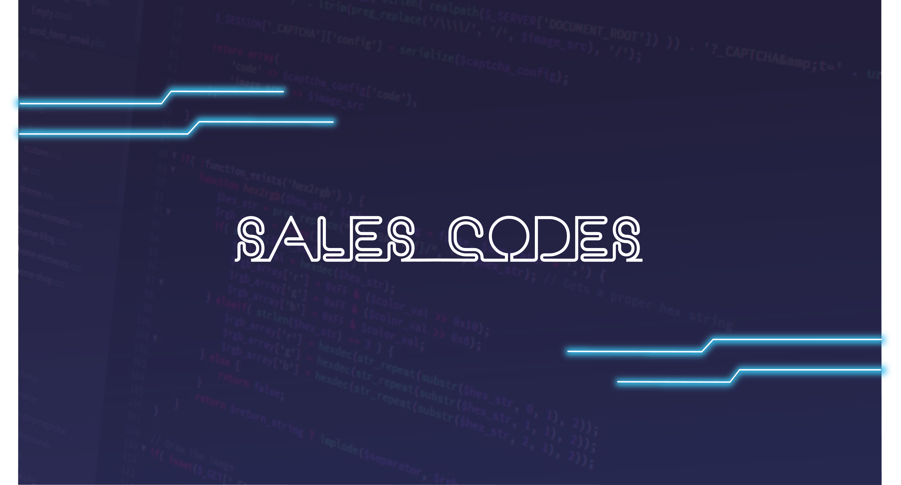

# Treinamento Lógica de Programação com PHP - SalesCodes

## Objetivo do treinamento

O treinamento tem como objetivo o ensino da lógica de programação utilizando a linguagem PHP. No decorrer do treinamento serão postados os exercícios realizados, além dos arquivos descritivos quando assunto teórico abordado.

## Índice

- [01 - Introdução](/01%20-%20Introdução/Introducao.md)
- [02 - Configurando Ambiente](/02%20-%20Configurando%20o%20Ambiente/Ambiente.md)
- [03 - PHP BuiltIN](/03%20-%20PHP%20BuiltIN/PHP%20BuiltIN.md)
- [04 - PHP CLI](/04%20-%20PHP%20CLI/PHP%20CLI.md)
- [05 - Variáveis](/05%20-%20Variáveis/Variaveis.md)
- [06 - Tipos Primitivos](/06%20-%20Tipos%20Primitivos/Tipos%20Primitivos.md)
- [07 - Algoritmos](/07%20-%20Algoritmos/Algoritmos.md)

## Canal no YouTube

<left>
  
</left>

## Contribuidores

<table>
  <td align="center">
  <a>
  
   
  <b>Ruan Sales</b>
  </a>
   
  
  
  
  
  </td>

  <td align="center">
  <a href="https://www.oerebor.dev">
  
   
  <b>Lucas Souza</b>
  </a>
   
  
  
  </td>
</table>
